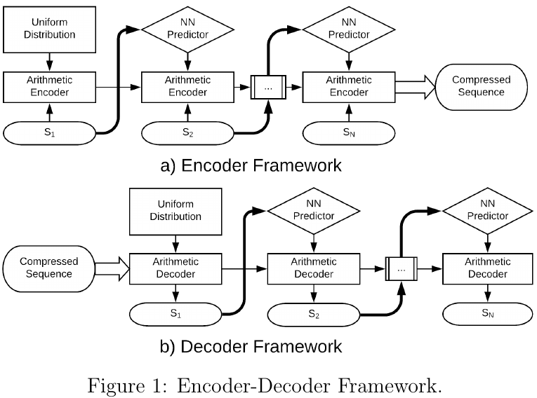
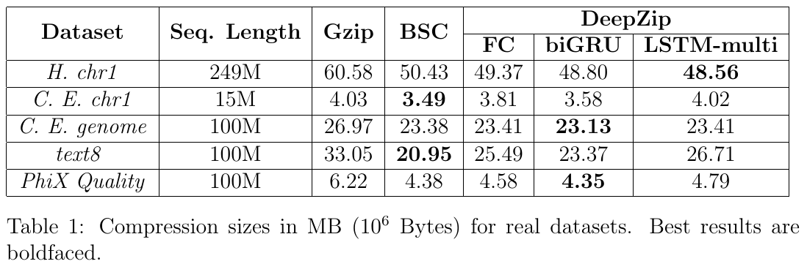
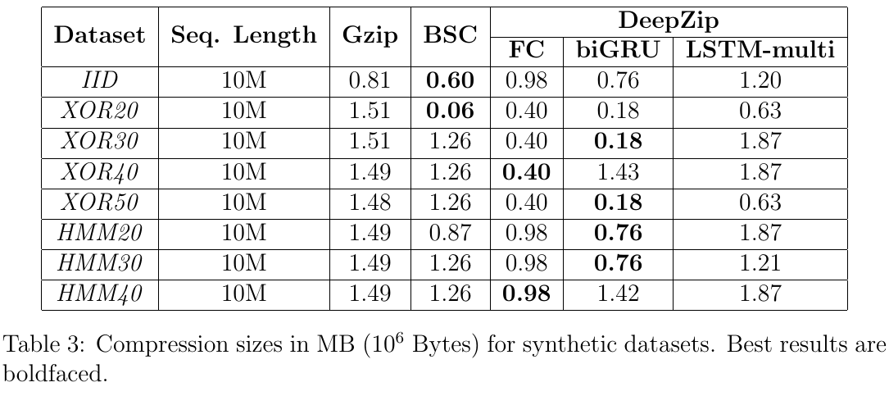
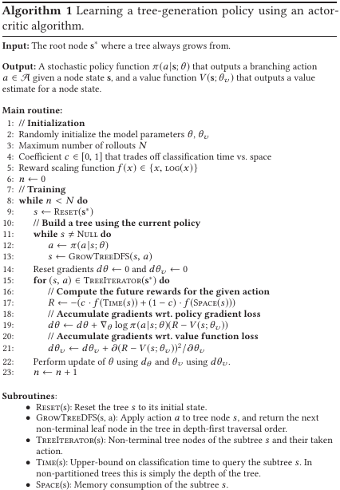
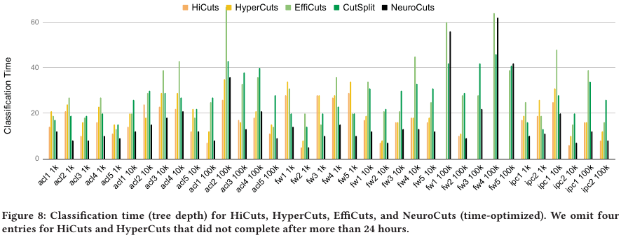
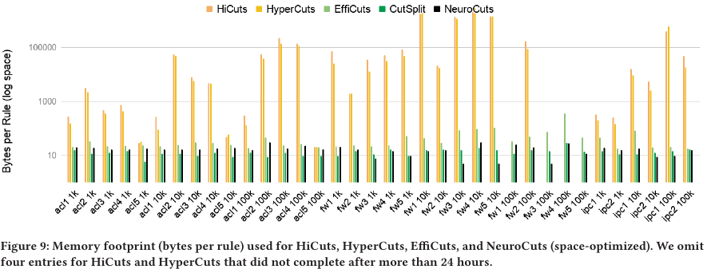

# Summarized papers published during 2019

[Go to full paper list](https://paulalmasan.github.io/Papers-in-short/)  

### *Spatio-temporal analysis and prediction of cellular traffic in metropolis*

Wang, X., Zhou, Z., Xiao, F., Xing, K., Yang, Z., Liu, Y., & Peng, C. IEEE Transactions on Mobile Computing, 2019.  
Link to paper: <a href="https://doi.org/10.1109/TMC.2018.2870135">https://doi.org/10.1109/TMC.2018.2870135</a>  
Code available? <b style="color:red;">NO</b>  

#### Keywords
Mobile Networks, Spatio-Temporal Analysis, Traffic Prediction

#### Problem addressed
In this paper, the authors propose a method for mobile traffic forecasting in urban areas. Their solution is expected to help carriers manage and schedule network resources efficiently in the future.

#### Background
The authors argue that the recent adaptation of the SDN and NFV paradigms in mobile networks enables cell towers to flexibly adapt to the traffic load. Having a forecast model that can predict the traffic in the future can assist network carriers to plan ahead and schedule network resources. With this scheduling strategy they can guarantee the network performance metrics and quality of service specifications. 

Forecasting cell-level traffic is challenging due to the large variation in traffic at individual cell towers. In addition, user’s mobility introduces spatial correlations between cell towers. Finally, human-related activities (e.g., holidays, social events) have a significant impact on cellular traffic behavior.

The authors analyze real-world data from around 6,000 cell towers from a major city in China. 

#### Solution
First, the authors study the data and they decompose the traffic into in-cell and inter-cell traffic. The first one corresponds to the traffic coming from mobile devices residing in the cell while the latter corresponds to traffic from devices entering the cell from another cell. The data analysis shows that there are some cell towers that have a higher proportion of inter-cell traffic than others. This indicates that the users are moving across cells, inducing spatial correlations among cell towers. The authors argue that it’s important to consider these spatial dependencies to accurately predict the cell traffic.

The authors represent the problem as a graph where nodes correspond to cell towers and the edges to the spatial dependency between two towers. As mentioned previously, the spatial dependency between distant towers comes from user mobility. In-cell traffic is assigned as a feature to the nodes while inter-cell is assigned to the edges. 

A model based on GNNs is trained for each cell tower. This model takes as input the node-level sequence of traffic values of the cell where the prediction is made, its neighbors and from the adjacent edges.

#### Evaluation
The authors compare their solution against 4 baselines, including ARIMA and a standard LSTM neural network. For comparison they use the MAE and MARE error metrics. 

The first set of experiments are regarding the model training. The results indicate that the model converges and its training stabilizes after around 200 epochs. The second set of experiments correspond to the performance comparison. Specifically, they compare the performance of predicting the cell-level traffic with all the baselines. The experiments show promising results for the GNN method, achieving the lowest MAE and MARE. This indicates that taking into accound spatial and temporal correlations helps predict more accurately than other methods that only take one of these approaches.

#### Take home ideas
* Cell traffic can be divided in two: in-cell which is the traffic of the devices connected to the cell tower, and inter-cell which is traffic coming from devices coming from another cell.  
* The high user mobility creates spatial correlations between cell towers.  
* The spatio-temporal model based on GNNs effectively predicts the cell traffic and outperforms the baselines that only consider the spatial or the temporal trends.  

### *DeepZip: Lossless Data Compression using Recurrent Neural Networks*

M Goyal, K Tatwawadi, S Chandak, I Ochoa. DCC 2019   
Link to paper: <a href="https://arxiv.org/abs/1811.08162">https://arxiv.org/abs/1811.08162</a>  
Code available? <b style="color:green;">YES</b>  
<a href="https://github.com/mohit1997/DeepZip" target="_blank" rel="noopener noreferrer">Link to code</a>

#### Keywords
Lossless Compression, Recurrent Neural Networks

#### Problem addressed
Sequential data is present in a wide range of applications or domains (e.g., text, voice). To efficiently store such a massive amount of information, compression techniques are required to work with and understand sequential data. The paper addresses the problem of compressing sequential data using Neural Networks (NN).  

#### Background
In the last years, we have seen a raise in the amount of new types of data generated (e.g., genomic, 3D, video, voice). Therefore, the research community studied the statistics of such data to propose good compressors. When data comes in a sequential form, it is well known that to have a good predictor of the next symbol leads to high compression ratios. In the paper, the authors propose DeepZip, a compression method that uses Recurrent NN (RNN) for lossless compression.

#### Solution
DeepZip consists of two main blocks: probability predictor and the arithmetic encoder. Given a data sequence of N symbols, the probability predictor block uses a RNN to process the data sequence and predict the probability distribution of the next symbol at the K-th timestep, where 0$<$K$<$N. This distribution is then passed to the arithmetic encoder block, which is responsible for encoding it into a state. This process is repeated until the end of the sequence, and thus, resulting in a compressed sequence that uses less bits than the original sequence. The better the predictor, the higher compression rate the arithmetic encoding can achieve. The decompression is symmetrical to the compression process (i.e., it starts by decompressing the first symbols using uniform probabilities and then it uses the RNN to obtain the probability distribution for each symbol). Figure 1 depicts the compression and decompression processes.

#### Evaluation
The authors compared the performance of DeepZip against some generic and some dataset specific compressors. They evaluated the compression performance using real and synthetic datasets. The real datasets include text and genomic data and the synthetic datasets were generated using known entropy rates. In addition, they evaluated different NN architectures (e.g., Fully Connected, bidirectional GRU) in the predictor block to find the one with highest performance.  

The results from Table 1 indicate that DeepZip with bidirectional GRU has a competitive performance when compressing real datasets. The authors remark that the model size has a significant impact on the overall size after compression, especially when the data sequences are short. Table 3 shows the results when compressing synthetic data. The authors argue that when the sequences have long-term dependencies, traditional compressors fail because they are not able to capture and use these dependencies to predict the next symbol.  

Images source: <a href="https://arxiv.org/abs/1811.08162" target="_blank" rel="noopener noreferrer">https://arxiv.org/abs/1811.08162</a>  

#### Take home ideas
* General purpose compressors (e.g., Gzip) perform poorly on domain specific data types (e.g., sequential data).  
* An accurate predictor leads to high compression ratios.  
* The NN model size has a direct impact on the overall size.  
* RNNs are able to achieve competitive compression performance.  

### *Experience-Driven Congestion Control: When Multi-Path TCP Meets Deep Reinforcement Learning*
Z Xu, J Tang, C Yin, et. al. IEEE Journal on Selected Areas in Communications, 2019  
Link to paper: <a href="https://ieeexplore.ieee.org/abstract/document/8664598" target="_blank"  rel="noopener noreferrer">https://ieeexplore.ieee.org/abstract/document/8664598</a>  
Code available? <b style="color:red;">NO</b>  

#### Keywords
Deep Reinforcement Learning, Congestion Control

#### Problem addressed
In this paper the authors are addressing the congestion control problem in Multi-Path TCP (MPTCP). MPTCP is a protocol that splits a flow among multiple network interfaces.  

#### Background
The authors argue that traditional solutions for network management perform poorly in modern networks. These networks (e.g., 5G network, IoT) are highly dynamic (i.e., they change during time) and they are very complex to manage. Existing solutions are either fast but with a low performance or with high accuracy but complex to formulate and execute.  

The authors explore the use of Deep Reinforcement Learning (DRL) for congestion control. Specifically, they propose DRL-CC, a DRL-based solution that is composed by a single agent that jointly performs congestion control for different MPTCP end-to-end connections. The objective of this DRL agent is to maximize the utility function (e.g., throughput, delay). To do this, the agent has a global view of all active MPTCP flows and decides how the congestion window should change in each decision step for a single flow. This DRL agent is placed only on the sending hosts (i.e., those that are sending IP packets).  

#### Solution
The proposed DRL solution consists of using a single DRL agent that decides how the congestion window changes for a target MPTCP flow. In addition, the architecture of the solution includes a Recurrent Neural Network (RNN) that uses a LSTM to learn the representation of the current state of all MPTCP flows. This is because different states can have a different number of flows, and thus, the solution needs to deal with a dynamic state (i.e., different sequence lengths of active flows). For each decision time-step, the state representation learned by the RNN and the state of the target MPTCP flow are fed into the DRL agent. Then, the DRL agent outputs some values indicating how to change the congestion window of the target MPTCP flow. Figure 1 summarizes the architecture of DRL-CC and the following summarizes the DRL setup:  

* State: The environment state is represented by the state of all regular TCP and MPTCP flows. At the same time, these states are composed by the sending rate, effective throughput, average RTT, mean deviation of RTT and the size of the congestion window.  
* Action: The action space specifies how much the congestion window has to change. For each time-step, the DRL agent decides the new congestion window only for one MPTCP flow.  
* Reward: The reward is the sum of the utility function for all MPTC/TCP flows. In their work, the authors chose the logarithm of the average effective throughput as a utility function.  

#### Evaluation
The experiments are performed on 2 laptops interconnected as client and server. In the first set of scenarios (from scenario 1 to 3), the experiments show that DRL-CC outperforms the baselines in effective throughput and has a very high fairness index. In the second set of scenarios, they test DRL-CC in a more complex environment. The results from Figures 5, 6 and 7 indicate that DRL-CC greatly outperforms the other baselines in dynamic and complex scenarios. The experiments from scenario 7 study how fair is with regular TCP flows. The results from Figure 8 indicate that DRL-CC is friendly with regular TCP.  

#### Take home ideas
* The RNN is useful to learn a good representation of all active MPTCP/TCP flows  
* DRL-CC achieves higher performance than the baselines, it’s robust in dynamic scenarios and it’s friendly with TCP flows  

[Go to full paper list](https://paulalmasan.github.io/Papers-in-short/) | [Go to top of the page](#summarized-papers-published-during-2019)

### *A Deep Reinforcement Learning Perspective on Internet Congestion Control*
N Jay, N Rotman, B Godfrey, et. al. International Conference on Machine Learning, 2019  
Link to paper: <a href="http://proceedings.mlr.press/v97/jay19a.html" target="_blank"  rel="noopener noreferrer">http://proceedings.mlr.press/v97/jay19a.html</a>  
Code available? <b style="color:green;">YES</b>  
<a href="https://github.com/PCCproject/PCC-RL" target="_blank" rel="noopener noreferrer">Link to code</a> 

#### Keywords
Deep Reinforcement Learning, Congestion Control

#### Problem addressed
The paper is addressing internet congestion control. This problem consists of finding the adequate transmission rates for different flows to efficiently utilize the network’s resources and provide a good user experience.  

#### Background
In computer networks, the sender sends data packets and expects some feedback from the receiver through packet acknowledgments (ACK). Then, the sender will adjust its transmission rate according to the feedback received. The connections between senders and receivers (or flows) share the resources of the underlay network (e.g., link capacity). If all the flows have a high transmission rate, it will result in network congestion, and thus, most of the data packets will be dropped. On the other hand, if the transmission rates are too low, the network's resources are underused. This is why it’s important to efficiently perform congestion control to find the optimal transmission rates.  

The authors argue that existing congestion control protocols (i.e., TCP) they fail to differentiate between congestion-caused loss and non-congestion loss (e.g., mobile handover). In addition, they show that TCP doesn’t adapt well to dynamic network conditions (i.e., link alternation between 20 Mbps and 40 Mbps). Figures 2 and 3 showcase these two limitations of TCP. The author’s propose to use DRL to adapt to dynamic network conditions and to take into account the current network state to find the sender’s transmission rates.  

#### Solution
The authors formulate the congestion control problem as a sequential decision making process. They divide the time into intervals and in each interval the DRL agent decides the transmission ratio in the sender. The following summarizes the DRL setup:  

* State: The state is composed by a series of statistics vectors (i.e., latency gradient and ratio, sending ratio, etc.) from the past actions. In other words, the series is bounded by some parameter to enable the DRL agent to detect trends in the past network conditions.  
* Action: It corresponds to a change in the sending rate. The DRL agent is the sender of data packets.  
* Reward: The reward depends on the performance metric that needs to be optimized (e.g., low latency, high bandwidth). Specifically, in their experiments the reward is composed by the network throughput, latency and packet loss.

#### Evaluation
The evaluation experiments are performed over a single sender and evaluated over a single link. In the experiments, they study the robustness of the DRL-based solutions. In these experiments, they vary the bandwidth, latency, queue size and loss far from the training distribution. They compare the DRL performance with TCP Cubic and PCC Vivace. The results indicate that the solution is comparable to state-of-the-art congestion control algorithms.  

#### Take home ideas
* DRL is a key technology to design novel congestion control algorithms that leverage historical data to find the efficient sending ratios  
* There are some open challenges that need to be addressed. Some examples are to include fairness, to consider multiple objectives and generalization to different network scenarios  

[Go to full paper list](https://paulalmasan.github.io/Papers-in-short/) | [Go to top of the page](#summarized-papers-published-during-2019)

### *TIDE: Time-relevant deep reinforcement learning for routing optimization*
P Sun, Y Hu, J Lan, L Tian, M Chen. Future Generation Computer Systems 2019  
Link to paper: <a href="https://www.sciencedirect.com/science/article/pii/S0167739X19305424?casa_token=K7fVgqdviVkAAAAA:TpoC0yVUSWRr-JCCKVNQwexRaI_eTUR_NdzVpfWYlBGv7RmnBCOTJWnlZ1ArpbhfmWyp164-bg" target="_blank"  rel="noopener noreferrer">Link to paper</a>  
Code available? <b style="color:red;">NO</b>  

#### Keywords
Deep Reinforcement Learning, Routing, Optimization  

#### Problem addressed
The problem addressed in this paper is routing optimization in a realistic SDN environment without relying on expert knowledge.  

#### Background
The field of Computer Networks has seen a rapid growth both in scale and network applications in the last years. Consequently, efficient network management has become more complex due to the highly dynamic traffic flow characteristics. For example, a dynamic routing strategy is needed to achieve real-time and a high performance in network management. This is difficult because of the complex traffic patterns and the acquisition of real-time traffic information. Existing routing optimization solutions are based on hand-crafted heuristics which typically perform poorly when the traffic distribution is highly dynamic.  

Software-Defined Networking is a paradigm that provides a centralized network management. To exploit its benefits, the authors propose TIDE, an intelligent network controller for routing optimization based on Deep Reinforcement Learning (DRL). Their proposal adds an Artificial Intelligence (AI) plane to the control and data planes inherent in the SDN architecture. Figure 1 shows an overview of the proposed solution. The DRL agent leverages the global view of the network, provided by the control plane, and outputs actions to optimize some Quality of Service (QoS) parameters (e.g., end-to-end delay, packet losses).  

#### Solution
The AI plane needs to have a global view of the network status in order to decide which is the best routing policy to apply. The authors propose a polling method for the network status information retrieval. This method is characterized by the SDN controller making status requests to the network switches. Then, each switch sends back to the controller local information about the traffic. A DRL agent is in charge of deciding the best routing strategy. This strategy is composed of some link weights, which are then sent to the controller. Then, the controller uses these link weights to apply the new routing policy, using a Floyd-Warshall algorithm, to compute the shortest paths for each traffic flow. The following summarizes the DRL setup:  

* State: The network state is represented by a multidimensional matrix n*t, where n is the number of switches and t is the length of a time series. The authors use traffic sequences instead of instantaneous snapshots of the traffic distribution to have a more detailed view of the network state.  
* Actions: The action is a weight for each link. The weights are later used by the controller to compute the weighted shortest paths to obtain the new routing policy.  
* Reward: The reward is a weighted sum of the end-to-end delay, jitter, throughput and packet loss. This is because different applications will require different QoS metrics, and thus, it can be indicated to the DRL agent which metrics to optimize (i.e., by setting to 0 the non-relevant metrics).  

Finally, the DRL agent is composed by a Recurrent Neural Network (RNN) to process the traffic sequences for each switch. The RNN will output a value for each sequence, and this is going to be feeded to a feed forward NN. This last NN is the one that will output the final link weights.  

#### Evaluation
The experiments are run on a real network configuration. The baseline used in the experiments is the Shortest Path (SP) and they only use delay and packet loss as QoS metrics to minimize. The experiments are run with different traffic intensities and compositions. In Figure 6 we can see the learning process of the DRL agent, where the bars correspond to the loss and the line to the delay, in a low traffic intensity scenario. The results indicate that the DRL agent is capable of learning to optimize the link weights to minimize the packet loss and the delay. Additional experiments were carried on a different scenario with higher traffic intensity. The results indicate that TIDE has more problems to outperform the SP. They argue that this is because for higher intensities the packet queues within the switches introduce additional delay and packet loss, which is not taken into account by the DRL agent. Finally, they compare the running time of the DRL agent against the SP. The results indicate that the DRL agent is slightly faster than SP and the difference becomes larger as the network size increases.  

<a href="https://www.sciencedirect.com/science/article/pii/S0167739X19305424?casa_token=K7fVgqdviVkAAAAA:TpoC0yVUSWRr-JCCKVNQwexRaI_eTUR_NdzVpfWYlBGv7RmnBCOTJWnlZ1ArpbhfmWyp164-bg" target="_blank" rel="noopener noreferrer">Images source</a> 

#### Take home ideas
* The DRL agent proposed in this paper indicates that it can learn how to generate routing policies that minimize some QoS metrics  
* The DRL execution time is fast (in the order of ms). This makes DRL a key technology that can be explored for near real-time routing optimization  
* Many challenges arise when trying to apply AI for routing optimizations. Some of them are: real-time network status information retrieval is not trivial, per-flow information is highly valuable, scalability to large network topologies must be taken into account  

[Go to full paper list](https://paulalmasan.github.io/Papers-in-short/) | [Go to top of the page](#summarized-papers-published-during-2019)

### *Neural Packet Classification*
E Liang, H Zhu, X Jin, I Stoica. SIGCOMM 2019  
Link to paper: <a href="https://arxiv.org/abs/1902.10319" target="_blank"  rel="noopener noreferrer">https://arxiv.org/abs/1902.10319</a>  
Code available? <b style="color:green;">YES</b>  
<a href="https://github.com/neurocuts/neurocuts" target="_blank" rel="noopener noreferrer">Link to code</a> 

#### Keywords
Deep Reinforcement Learning, Packet Classification  

#### Problem addressed
The authors propose a method based on DRL to solve the Packet Classification problem. This problem is defined by finding the rule, from a given set of rules, that needs to be applied to the incoming IP packets. These rules are shaped by five fields: source and destination IP address, source and destination ports and protocol used (e.g., TCP, UDP). An additional priority field is used to choose between rules that overlap. It is said that a rule is found if all packet fields are contained within their corresponding rule fields.  

#### Background
Existing solutions to the packet classification problem can be divided into two categories. The first category would be the hardware-based solutions. Such solutions use specific hardware (e.g., TCAMs, GPUs, FPGAs) to store efficiently the rules, which allows to have a fast lookup time (i.e., time to find the matching rule to a given packet). The problem of such solutions is that when the number of rules increases, they are complex and expensive (because you need to buy specific hardware). The alternative category englobes the software-based solutions. These solutions build sophisticated data structures that allow efficient packet classification. The drawback of these solutions is that they are slower than the hardware-based classifiers, but they scale better to larger sets of rules.  

Typically, software-based solutions build decision trees that need to be traversed at lookup. As more efficient is the tree structure, the faster it is to traverse and to find the matching rule for the incoming packet. Many efforts have been dedicated to find the best way to build the decision tree. However, such solutions rely on carefully designed heuristics, preventing them to adapt to different sets of rules. The authors propose to use Deep Reinforcement Learning (DRL) to solve the packet classification problem. They argue that to build a decision tree maps naturally to RL methods.  

The authors propose NeuroCuts, a DRL-based solution for solving the packet classification problem. Their solution learns to build a decision tree minimizing some objective function (i.e., memory, lookup time or a combination of both). The DRL agent uses a Deep Neural Network to select the best cut/partition action and the environment is defined by the set of rules, the current decision tree and the next node to process. Figure 4 illustrates how the DRL agent interacts with the environment.  

#### Solution
During the DRL learning process, the decision tree changes dynamically according to the actions performed. This means that the tree grows in size during execution. This makes it difficult to encode the tree in the environment state, as this requires a fixed size state. The authors make the observation that to split a tree node it only depends on the node itself (i.e., information from the rest of the tree is not required). Therefore, they encode in the state only the information of the node that the DRL agent needs to split. In other words, the environment builds the decision tree one node at a time, and thus, the actions need only consider the current node state. The following summarizes the DRL setup:  

* State: Instead of storing the tree structure in the state, the authors only store a fixed-size representation of the node that needs to be split (i.e., the information regarding the rest of the tree is not included in the state).  
* Action: There can be two types of actions. The first one is the cut action which divides a node from the decision tree along one dimension (i.e., one of source IP, destination IP, source Port, destination Port and Protocol). This cut creates different sub-ranges (i.e., child nodes). The second kind of action is the partition action. This action divides the rules of a node into different subsets, creating a child node for each subset.  
* Reward: Once an action is taken for a given node, this will lead to a different subtree. Thus, the reward is based on the information of that subtree (i.e., subtree depth or size). This reward can only be computed once the tree is entirely built.  

Algorithm 1 shows the pseudocode of the training process. The author's solution can be easily parallelized, which is relevant to scale to large packet classifiers (with thousands of rules). Also, the proposed solution accepts rule updates. Small updates directly modify the existing decision tree. However, when there are many updates or a large update, NeuroCuts executes the training process again. Finally, NeuroCuts can incorporate heuristics to improve the decision trees the DRL agent builds. The current NeuroCuts implementation allows the simple partition action in which the node is partitioned on a single dimension, and the EffiCuts partition, where nodes are partitioned using the EffiCuts heuristic.  

#### Evaluation
The authors compare NeuroCuts against state-of-the-art software-based packet classification solutions (both in classification time and memory footprint). They use ClassBench to generate different sets of rules with different characteristics. In Figure 8 and 9 we can see the classification times and memory footprint respectively (the x-axis represents different rule sets). In the experiments from the previous figures, NeuroCuts was parameterized to optimize solely classification time or memory respectively. Other experiments were performed to study if the proposed solution can improve existing heuristics and to study the sensitivity of NeuroCuts to hyperparameters.  

  
  

Images source: <a href="https://arxiv.org/abs/1902.10319" target="_blank" rel="noopener noreferrer">https://arxiv.org/abs/1902.10319</a>  

#### Take home ideas
* NeuroCuts showed significant improvements in the design of efficient decision trees for packet classification (both in time, space and the combination of both)  
* The DRL algorithm must be carefully designed because the optimization of the packet classification decision tree raises new challenges that need to be addressed (i.e., variable length decision tree, sparse rewards, scalability to large packet classifiers)  

[Go to full paper list](https://paulalmasan.github.io/Papers-in-short/) | [Go to top of the page](#summarized-papers-published-during-2019)
