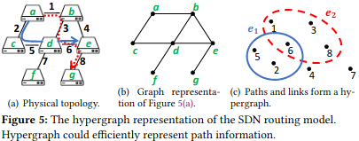
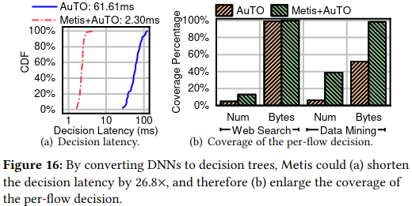

# Summarized papers published during 2020

[Go to full paper list](https://paulalmasan.github.io/Papers-in-short/)  

### *Neural-Enhanced Live Streaming: Improving Live Video Ingest via Online Learning*
J Kim, Y Jung, H Yeo, J Ye, D Han. SIGCOMM 2020  
Link to paper: <a href="https://dl.acm.org/doi/abs/10.1145/3387514.3405856" target="_blank" rel="noopener noreferrer">https://dl.acm.org/doi/abs/10.1145/3387514.3405856</a>  
Code available? <b style="color:red;">NO</b>   

#### Keywords
Live Streaming, Online Learning, Video quality enhancing  

#### Problem addressed
In a video streaming context, the video quality is constrained by the streamer’s uplink bandwidth and it’s computing capacity. This hinders the streaming of high-quality video (e.g., 4K), reducing the user's quality of experience (QoE). This paper proposes a method to enhance the video quality on the server side during video streaming.  

#### Background
In the last few years, video streaming became popular thanks to platforms like YouTube and Twitch. Nowadays, a significant volume of the Internet traffic corresponds to live video. In addition, several studies state that the trend in the growth of live video will continue in the years to come.  

Streaming systems are generally composed of an ingest side and a distribution side. The first one is in charge of sending the video from its streaming source to the media server. The distribution side is in charge of distributing the live stream video to thousands of viewers. In this context, the video quality is constrained by the streamer’s computing power and uplink bandwidth. For example, if the streamer is streaming from a remote place with limited uplink bandwidth, the video quality will be limited to the available bandwidth, and thus, delivering a poor live stream video to the end viewers. In addition, to stream high-quality videos (e.g., 4K) requires the streaming device to have a powerful CPU/GPU for video encoding, which is not always possible (e.g., when streaming video using a smartphone).  

#### Solution
This paper proposes LiveNAS, a DNN-based video enhancement framework that maps low-quality to high-quality videos. On the streamer side, LiveNAS incorporates a scheduler to balance between uplink bandwidth and video training patches. In addition, there is a scheduler that is in charge to select the video patches that are going to be transmitted to the ingest server. On the server side resides the DNN that enhances the video quality. This DNN is trained using the patches received from the streamer. The intuition behind this is to perform online-learning on the server side to adapt the DNN weights to the real-time video changes. The training process is adaptive, meaning that training of the DNN is only performed when required (e.g., when the video content changes considerably with time). Figure 3 shows the general overview of LiveNAS.    

#### Evaluation
LiveNAS is evaluated on a wide variety of videos (including streaming). The first experiments are meant to showcase the video quality improvement of LiveNAS and compare it with other solutions. The results from Figure 9 indicate that LiveNAS greatly outperforms the other baselines in enhancing the video quality to 1080p. In addition, the authors show the gains of performing online learning in contrast to pre-trained video enhancing models. The second set of experiments are related to resource efficiency in the online learning process. The results indicate that LiveNAS is more efficient at using the GPU resources as it only trains the DNN when the video content changes a lot (i.e., many scene changes). Finally, the authors show that LiveNAS brings a large improvement in QoE for Twitch and YouTube streams and videos respectively.  

#### Take home ideas
* Video enhancing techniques using DNN seem very promising to increase the QoE. Typically, such DNN are placed in the ingest servers because they require high computing capacity  
* The video enhancing DNN doesn’t require the whole frame for training,It can be trained using patches and still obtain significant video quality improvement  
* Online learning is a resource-efficient approach used to dynamically train the video enhancing DNN  

[Go to full paper list](https://paulalmasan.github.io/Papers-in-short/) | [Go to top of the page](#summarized-papers-published-during-2020)

### *Combining Reinforcement Learning and Constraint Programming for Combinatorial Optimization*
Q Cappart, T Moisan, LM Rousseau, et. al. ARXIV 2020  
Link to paper: <a href="https://arxiv.org/abs/2006.01610" target="_blank" rel="noopener noreferrer">https://arxiv.org/abs/2006.01610</a>  
Code available? <b style="color:green;">YES</b>  
<a href="https://github.com/qcappart/hybrid-cp-rl-solver" target="_blank" rel="noopener noreferrer">Link to code</a>  

#### Keywords
Reinforcement Learning, Constraint Programming, Combinatorial Optimization, Dynamic Programming

#### Problem addressed
The authors address the combinatorial optimization problem (COP). Specifically, they want to find a better way to reach the optimal solution of a COP in a shorter amount of time.  

#### Background
In general there are two ways to solve COPs. First, there is the family of exact algorithms, which means that they provide the optimal solution but they require a large computation time for big problem instances. However, some implementations return the best solution found so far instead of having to wait until the optimal one is reached. This is the case of Constraint Programming (CP). Second, we have the family of heuristic algorithms. These algorithms require expert knowledge to be designed but they can reach good solutions very fast. In recent years, Deep Reinforcement Learning (DRL) has shown to achieve high-quality results for complex problems. In this work, the authors want to leverage the strengths of both methods to build better tools to solve COPs.  

#### Solution
The authors propose to combine DRL and CP for solving COPs. Specifically, they use Dynamic Programming (DP) as a bridge between both techniques. DP is a method that breaks a problem into sub-problems through a recursive formulation. However, the curse of dimensionality rises, which means that the number of generated sub-problems rises exponentially, making it infeasible to solve with off-the-shelf hardware. One way to solve this issue is by pruning the action space but there is no simple way to do this without excluding good solutions or it might not be enough to reduce the solution space to a feasible size. The authors propose to encode the DP formulation into a RL environment. In other words, they want to train a DRL agent that will do the pruning efficiently. The authors train several DRL agents using the PPO and DQN algorithms. The general overview of the contributions can be seen in Figure 1. The green blocks are the author’s contributions from this paper. The following summarizes the DRL setup: 
* State: The state is defined by a pair (Q, s) where s is the DP state at a given stage and Q is the problem instance that we are trying to solve. 
* Action: Given a state s, an action is an assignment of the DP’s decision variables. Only valid assignments are allowed by setting some validity conditions.
* Reward: The authors define a reward that encourages the DRL to find a feasible solution first (see more details in Section 2.2 from the paper).  

The authors propose to use a Graph Attention Network (GAT) or set Transformer as the DRL agent’s neural network architecture. This is to enable the DRL agent to work with COPs of different sizes (i.e., different number of variables) and to make the results be invariant to input permutations.  

Finally, once the DRL agent is trained, a search strategy to find the COP’s solutions must be defined. It’s here where the knowledge learned by the DRL agent will be used to find the COP solutions. The authors propose three different search strategies: Depth First Branch-and-Bound (BaB) and Iterative Limited Discrepancy Search (ILDS) for the DQN method, and Restart Based Search (RBS) for PPO. The BaB method, when it first finds a feasible solution, adds a new constraint to the DP problem to ensure that the next solution has to be better than the current solution. If an infeasible solution is found, the search is backtracked to a previous decision and the search continues through other actions. To avoid re-computing Q-values for previously-visited states, the authors propose the use of a cache mechanism. In this cache memory they store Q-values for different states to reuse them if a state is re-visited.  

#### Evaluation
The authors test their solutions on two NP-hard problems: Travelling Salesman Problem with Time Windows (TSPTW) and 4-moments Portfolio Optimization Problem (PORT). Table 1 shows the results for the TSPTW. In this table, OR-Tools is a solver from Google, PPO uses beam-search of width 64, DQN uses a greedy selection policy, CP-model and CP-nearest are constraint programming formulations with different search strategies. We can observe that for large instances, almost all solutions based on CP can't solve any COP instance at all. From the proposed solutions, the ones with cache have a smaller execution time and they reach the optimal solutions in more cases than without cache.  

  

Table 2 shows the results for the PORT problem. The problem instances are divided between discrete and continuous coefficients. In the discrete case, non-linear solvers have more problems to find a solution because the objective function is not continuous. However, the Hybrid approaches proposed by the authors seem to don’t be affected at all.  

Images source: <a href="https://arxiv.org/abs/2006.01610" target="_blank" rel="noopener noreferrer">https://arxiv.org/abs/2006.01610</a>  

#### Take home ideas
* The strengths of DRL (i.e., speed) and CP (i.e., high quality solutions) can be leveraged together to solve COPs
* The combination of DRL and CP showed outstanding results compared with solely DRL or traditional solvers. This is specially relevant for large problem instances where traditional solvers are not able to find solutions without reaching a time out
* The use of a Neural Network inside a DP solver is expensive. To reduce this bottleneck, the caching mechanism seemed to help a lot

[Go to full paper list](https://paulalmasan.github.io/Papers-in-short/) | [Go to top of the page](#summarized-papers-published-during-2020)

### *Interpreting Deep Learning-Based Networking Systems*
Z Meng, M Wang, J Bai, M Xu, et. al. SIGCOMM 2020  
Link to paper: <a href="https://arxiv.org/abs/1910.03835" target="_blank" rel="noopener noreferrer">https://arxiv.org/abs/1910.03835</a>  
Code available? <b style="color:green;">YES</b>  
<a href="https://github.com/transys-project/metis/" target="_blank" rel="noopener noreferrer">Link to code</a>  

#### Keywords
Networking Systems, Deep Learning, Interpretability 

#### Problem addressed
Deep Learning (DL) based solutions for networking systems are typically seen as black boxes that lack methods for interpretation. Because of the lack of understanding in what a DL model learned, network operators might not feel confident in the deployment of DL-based solutions in critical networking systems. This paper provides a framework to interpret DL-based solutions in a more readable and close-to-human approach. In other words, the authors propose a method to interpret the knowledge learned by a Neural Network (NN) to enable network operators to easily deploy and debug DL-based solutions. 

#### Background
DL-based solutions typically contain a large number of neurons. This can hinder the deployment of DL-based solutions on network applications for several reasons. One reason is that the knowledge learned by the NNs is difficult to understand by the network operators. In addition, network operators might need the interpretability of a NN to make adjustments in the network system. Another reason is that NNs can be time consuming to execute, which makes them inappropriate for time-critical applications.  

The Machine Learning (ML) community has studied the interpretability of NNs. However, existing methods are not appropriate for networking systems. This is because in ML they typically investigate the NN structure, while in networking systems it might be more useful to study the input-output relationships (e.g., which input link has more impact in the delay prediction). In addition, the diverse set of NN architectures (e.g., Recurrent NN, Graph NN, Feed-Forward NN) and the non-standard state and action spaces makes it difficult to create a single framework to interpret NN’s behaviours.  

The authors propose Metis, a general framework to provide interpretation to different DL-based solutions for networking systems. To do this, they divide existing networking systems into local and global systems and they provide different interpretability techniques for both of them. Local systems collect information and make decisions locally, while global systems aggregate information and make decisions that will affect the whole network (e.g., central controller in SDN).  

#### Solution
To interpret DL-based solutions for local systems, the authors propose to convert NNs to human-readable decision trees. They argue that decision trees are similar to rule-based network systems policies. In addition, decision trees can represent complex policies and they are lightweight. To convert a trained NN to a decision tree they use a teacher-student training process. This process consists of using the trained NN as a teacher that generates input-output samples, which are later used to train the student’s decision tree. The size of the decision tree can become very large (i.e., thousands of leaf nodes) which hinders the interpretability by the network operators. The authors propose to use a pruning technique to reduce the size of the decision tree. Experimental results showed that the performance degrades only by 0.6% when pruning the tree.  

The authors formulate global systems as hypergraphs. The particularity of hypergraphs is that the edges (called hyperedges) can cover multiple vertices (see Figure 5b and 5c). Once the global system is formulated as an hypergraph, the authors propose a method to find the critical vertex-hyperedge connections that will have a larger impact in the predicted result by the NN. This method consists of formulating an optimization problem that tries to find the critical connections. To do this, they first introduce the incidence matrix which indicates with 0 or 1 if there is a connection between a vertex and hyperedge or not. Then, a fractional incidence matrix is introduced that has the same size as the incidence matrix. In this matrix the values go from 0 to 1, where values close to 0 indicate that the respective connection in the incidence matrix is non-relevant and values close to 1 indicate a critical connection. Therefore, the optimization problem consists of finding the mask values that when applied to the input features (i.e., connections between vertices and hyperedges), the output of the NN is similar to the original output of the NN. These mask values are going to indicate which connections from the hypergraph are more relevant for the prediction.  

#### Evaluation
There are wide variety of experiments with different use cases to demonstrate different features of Metis but I’ll focus just on some of them. The first experiment they do is to interpret the policy learned by the NN in both local and a global systems. Figure 7 shows the top 4 layers of a decision tree, with different decision variables, extracted from a NN trained in a local system (see Section 6.1 for more details). Regarding the global system, they train RouteNet and in Table 3 they show the top 5 masks with higher value (i.e., higher impact in the prediction). In the Section 6.2 they show a use case of using Metis to help in the design of the NN structure. Section 6.3 is a different use case where the authors show that Metis can enable the network operators to debug a NN and understand why is making some decisions. The following section shows that the decision trees created by Metis in local systems are lightweight. First, they show that the performance degradation in the conversion from NN to decision tree is minimal. Figure 15 shows this performance degradation. In addition, decision trees are faster to execute than NN, which means that they have smaller decision latency. They show in the results from Figure 16 that Metis achieved much smaller latency. Finally, the Section 6.5 shows how to leverage Metis to make ad-hoc adjustments on RouteNet.

  
  

Images source: <a href="https://arxiv.org/abs/1910.03835" target="_blank" rel="noopener noreferrer">https://arxiv.org/abs/1910.03835</a>  

#### Take home ideas
* Neural Networks lack interpretability and this hinders the deployment of this technology in real-world networks  
* Existing techniques to understand NN behaviours are typically not adequate for network systems. This is because the network systems field has a wide range of applications with different NN requirements which makes it difficult to apply a global NN interpretability solution  
* The authors divides existing NN-based solutions for network systems in two fields: local and global systems. Then, they provide two different solutions to interpret the knowledge learned by the NNs in a more human readable way  
* The experimental results indicate that the interpreted information extracted from the NN (in both local and global systems) can help network operators deploy DL-based solutions in practice  

[Go to full paper list](https://paulalmasan.github.io/Papers-in-short/) | [Go to top of the page](#summarized-papers-published-during-2020)

### *CFR-RL: Traffic Engineering With Reinforcement Learning in SDN*
J Zhang, M Ye, Z Guo, CY Yen, et. al. IEEE Journal on Selected Areas in Communications 2020  
Link to paper: <a href="https://arxiv.org/abs/2004.11986" target="_blank" rel="noopener noreferrer">https://arxiv.org/abs/2004.11986</a>  
Code available? <b style="color:green;">YES</b>  
<a href="https://github.com/jrayzhang6/CFR-RL" target="_blank" rel="noopener noreferrer">Link to code</a>  

#### Keywords
(Deep) Reinforcement Learning, Traffic Engineering, Software Defined Networking  

#### Problem addressed
The problem being addressed in this paper is Traffic Engineering (TE). This problem consists of optimizing the network performance by changing the routing configuration for a given traffic matrix.  

#### Background
The authors argue that there are already existing solutions that offer close-to-optimal performance when optimizing the performance of a network. However, they don’t consider other relevant aspects such as packets out of order. In addition, these solutions might be changing the routing configuration of many traffic flows to slightly reduce the maximum link utilization. This implies a significant network disturbance and service disruption. In other words, to change the routing of a flow could lead to temporary affectations in the flows’ TCP operation. Consequently, such disturbances will cause duplicate ACK transmissions,  forcing the sender to reduce the congestion window. This will create a chain of reactions that eventually will decrease flow’s Quality of Service (Qos).  

The authors propose to reduce the network disturbance using Equal-Cost Multi-Path (ECMP) and reroute solely the critical flows of the network to reduce the link utilization in the most congested link. The authors define a critical flow as the one with high impact on the network performance (e.g., flow in the link with maximum utilization). Thus, they split the TE problem into two sub-problems: first is to find a way to identify the critical flows, the second problem is to change the routing configuration for such flows by increasing the network performance. The authors use Linear Programming (LP) to solve the second problem. However, the first problem is challenging as the algorithm to select the critical flows should be able to adapt to network changes. This discards the use of heuristic-based solutions as they are not flexible for dynamic environments. Therefore, the authors propose to use Deep Reinforcement Learning (DRL) to train an agent that will effectively select the critical flows from the network.  

#### Solution
The solution proposed leverages DRL to select critical flows given a traffic matrix. The DRL agent (a.k.a. CFR-RL) is trained over a set of historical traffic matrices obtained by a central SDN controller. Then, the agent learns a policy to select the critical flows from a given traffic matrix. The selected flows are sent to a LP solver that will output the optimal routing policies. The other flows (the non-critical ones) will use ECMP as default routing policy. The following summarizes the DRL setup:  
* State: the state space is a traffic matrix. The network topology remains unchanged, and thus, topology-related information is not necessary to be included in the state space. The agent is evaluated in the same topology used during training.  
* Action: the action is to select K critical flows. There are a total of N*(N-1) flows, where N is the number of nodes and K<=N.  
* Reward: The DRL agent receives a reward after rerouting the selected K critical flows. The reward is obtained from 1/U, where U is the maximum link utilization. In other words, as U becomes smaller, the reward gets larger (which is good).  

Once the DRL agent selects the critical flows, a LP solver finds the new routing policy for them. The LP will find the ratios of the traffic demand that will be routed on each link from the topology. In other words, the LP will return the percentage of the original traffic from each critical flow that will be allocated on each link from the topology. This means that if there are E links and K critical flows, the LP routing solution will consist of E*K split ratios.  

#### Evaluation
The authors run a set of experiments to compare different performance metrics (i.e., load balance performance ratio, end-to-end delay performance ratio and rerouting disturbance). The baselines they chose to use are the default ECMP, the Top-K heuristic (i.e., K largest flows of the traffic matrix) and the Top-K Critical (i.e., K largest flows from the most congested links). The authors trained a DRL agent per topology (with a total of 4 topologies), and these agents were evaluated on the same topologies used during training but with different traffic matrices.  

The first experiments performed are to study the impact of the number of critical flows selected (i.e., the parameter K). In Figure 3 we can see the average performance ratio for different K values for the 4 topologies. A performance ratio of 1 indicates optimal performance. The results indicate that only by selecting 10% of the flows the network performance can be optimized almost to it’s optimal state. Figure 4 shows the results of the average load balancing performance for all 4 network topologies. As closer to 1 is the load balancing performance ratio PRu, as closer is to the optimal performance. Notice that a PRu = 1 mens that it achieved optimal performance. Additional experiments were performed to compare the delay performance ratio (which was estimated using a mathematical formula based on the link utilization and capacity). Finally, the authors compute the rerouting disturbance (i.e., percentage rerouted traffic from the total traffic) and the results can be seen in Table II. These results indicate that CFR-RL achieves close-to-optimal performance just by rerouting around ~10% of the total traffic for the EBONE, Sprintilink and Tiscali topologies. For the Abilene network the percentage is higher but it's still better than the baselines.  

  

Images source: <a href="https://arxiv.org/abs/2004.11986" target="_blank" rel="noopener noreferrer">https://arxiv.org/abs/2004.11986</a>  

#### Take home ideas
* To select solely the critical flows (around ~10% of the total flows) and to optimize the routing of these flows it’s enough to achieve a close-to-optimal performance and a minimum network disturbance  
* CFR-RL achieves a close-to-optimal performance and the experimental results showed that it generalizes well to different traffic matrices not seen during training (see Figure 8 to 11 in the paper)  
* DRL and LP can be efficiently combined to achieve high optimization performance (however, the optimization cost of the LP must be taken into account!)  

[Go to full paper list](https://paulalmasan.github.io/Papers-in-short/) | [Go to top of the page](#summarized-papers-published-during-2020)

### *Combining Deep Reinforcement Learning With Graph Neural Networks for Optimal VNF Placement*
P Sun, J Lan, J Li, Z Guo, Y Hu. IEEE Communications Letters 2020  
Link to paper: <a href="https://ieeexplore.ieee.org/document/9201405" target="_blank" rel="noopener noreferrer">https://ieeexplore.ieee.org/document/9201405</a>  
Code available? <b style="color:red;">NO</b>  

#### Keywords
Deep Reinforcement Learning,  Network Function Virtualization, Graph Neural Network  

#### Problem addressed
This paper is trying to solve the Virtual Network Function (VNF) placement problem, which has been proven to be NP-Hard.  

#### Background
This paper proposes DeepOpt, a VNF placement scheme that uses Deep Reinforcement Learning (DRL) combined with Graph Neural Networks (GNN). The architecture overview can be seen in Figure 1. The DRL agent uses a GNN to process the network state information and interact with the environment through actions (i.e., a VNF placement policy). These actions generate transitions in the network from a previous state to a new one. At the same time, a reward is generated for each transition to guide the DRL agent in the learning process. This reward indicates how good is the VNF placement policy generated by the DRL agent.  

#### Solution
The network state consists of nodes and edges attributes. These attributes are used by the DRL agent in the GNN processing step. The GNN generates an action, which is a binary list indicating for each node if it's selected or not to place the VNFs (i.e., VNF placement policy). The action is then applied to the network, creating a transition from the old state to a new network state and a reward. Using REINFORCE, the DRL agent is trained (it’s GNN), leading to better actions over time.  

#### Evaluation
The authors compare DeepOpt with a state-of-the-art DRL-based scheme and two other baselines (see Section IV). The results from Figure 3 shows that DeepOpt obtains the smallest SFC reject ratio (as smaller as better) among all baseline. The second experiment they run is to evaluate the same baselines on different random topologies obtained by removing/adding random nodes. In the results from Figure 4 we can see that the state-of-the-art DRL solution has trouble to generalize to other topologies. Even though the other baselines (i.e., MSGAS and Eigendecomposition) they also generalize well, we must notice that they have a very high computation time (see Figure 5).  

<a href="https://ieeexplore.ieee.org/document/9201405" target="_blank" rel="noopener noreferrer">Images source</a>  

#### Take home ideas
* The GNN enables the DRL agent to generalize to other topologies and still obtain a good performance  
* The GNN adds some overhead in the computation time of the DRL agent compared to having a simple feed-forward neural network instead  

[Go to full paper list](https://paulalmasan.github.io/Papers-in-short/) | [Go to top of the page](#summarized-papers-published-during-2020)